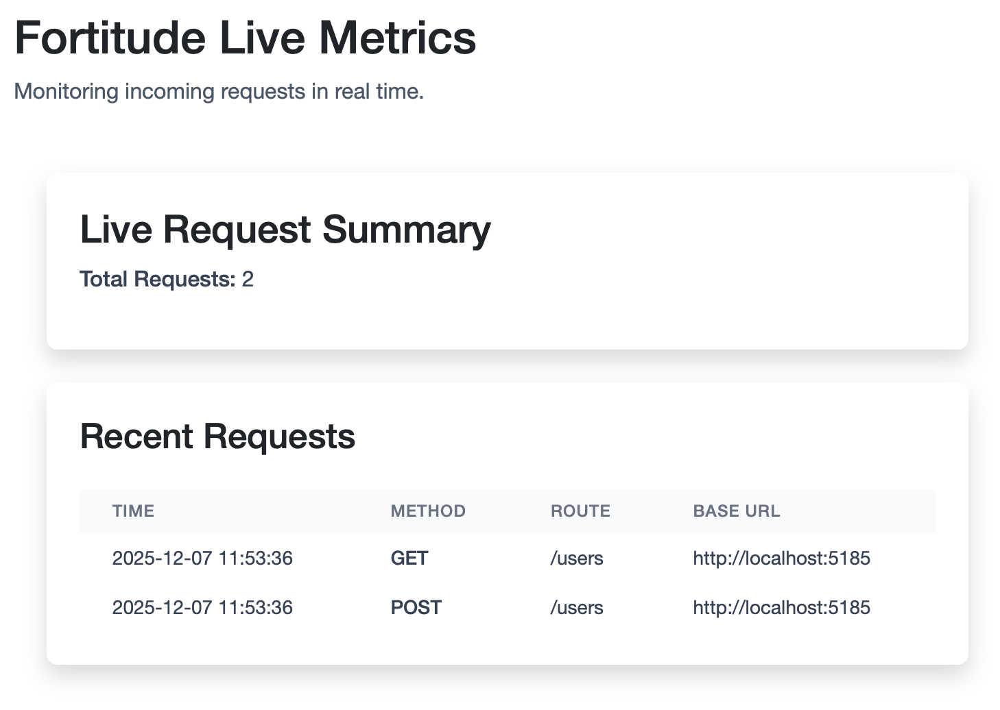

# Fortitude Server - WIP
_Fortitude spins up a local mock server so you can fluently configure HTTP routes, responses, and test scenarios directly from your .NET tests._

<p align="center">
  
</p>

[NuGet](https://www.nuget.org/packages/Fortitude) - 
[Docker](https://hub.docker.com/r/aptacode/fortitude-server)

## What is Fortitude?
Fortitude is a .NET testing utility that lets you control and simulate external HTTP APIs directly from your tests. It’s perfect for functional and behavioral testing when your system under test (SUT) depends on services that are unavailable, difficult to run locally, or expensive to maintain.

With Fortitude, your tests can:
- **Define expected API behavior dynamically and fluently**, including headers, query parameters, methods, and body content
- **Perform true black-box integration** tests without fragile mocks or stubs
- **Track, assert, and wait for requests** to ensure the SUT interacts with external services correctly
- **Simulate realistic responses** so your SUT thinks it’s calling real APIs
- **Run multiple tests concurrently** against the same mocked service without conflicts, thanks to per-client port reservation


Fortitude keeps expected behavior close to the test code, increases code coverage, and reduces the complexity of maintaining mocks. Essentially, it gives you full control over your SUT’s external dependencies while letting your tests remain fast, reliable, and expressive.

### Running the Fortitude Server via Docker

```bash
# Pull the latest Fortitude Server image:
docker pull aptacode/fortitude-server:latest

# Run on a single specific port
docker run -e PORT=5005 -p 5005:5005 aptacode/fortitude-server:latest

# Run with a port range (recommended for parallel test execution)
docker run -e PORTS=5000-5005 -p 5000-5005:5000-5005 aptacode/fortitude-server:latest


```

### Example

[An example project / tests can be in the examples directory.
](Examples/)

To run the example tests:
```bash
# Run the Fortitude Server Project
dotnet run --project ./Fortitude.Server/

# Or run on a single fixed port
docker run -e PORT=5005 -p 5005:5005 aptacode/fortitude-server:latest

# Run the tests
dotnet test ./Examples/Fortitude.Example.Tests

```

**Make sure to add the NuGet package to your test project**

[Fortitude on NuGet](https://www.nuget.org/packages/Fortitude)

```bash
# Install via the .NET CLI:
dotnet add package Fortitude --version 10.0.0
```


Here is a sample Test which connects to the Fortitude Server and intercepts request coming from the SUT

```csharp
    [Fact]
    public async Task CreateUser_ForwardsRequestToExternalApi_AndReturnsCreatedResult()
    {
        // Given: Fortitude fake server simulating the external API
        var (fortitude, mockServiceUrl) = await FortitudeServer.ConnectAsync(FortitudeBase, output);

        var expectedName = "Alice";
        var expectedEmail = "alice@example.com";

        // Fake external handler: POST /users
        var handler = fortitude.Accepts()
            .Post()
            .HttpRoute("/users")
            .Body(body => body.ToJson<User>()?.Email == expectedEmail)
            .Returns((request, response) =>
            {
                var reqObj = request.Body.ToJson<User>()!;
                response.Created(new User(999, reqObj.Name, reqObj.Email));
            });
        
        // And: The SUT (your API) is running with ExternalApi.BaseUrl overridden
        var client = factory
            .WithWebHostBuilder(builder =>
            {
                builder.ConfigureAppConfiguration((ctx, config) =>
                {
                    config.AddInMemoryCollection(new Dictionary<string, string?>
                    {
                        // Configure your SUT to point at the Fortitude Server
                        ["ExternalApi:BaseUrl"] = mockServiceUrl
                    });
                });
            })
            .CreateClient();

        // WHEN: Client calls into your SUT API
        var response = await client.PostAsJsonAsync("/users", new User(0, expectedName, expectedEmail));

        response.EnsureSuccessStatusCode();

        var created = await response.Content.ReadFromJsonAsync<User>();
        
        // Then: Response should be what Fortitude returned
        Assert.NotNull(created);
        Assert.Equal(999, created!.Id); // ID assigned by external service
        Assert.Equal(expectedName, created.Name);
        Assert.Equal(expectedEmail, created.Email);
        
        // Assert only a single request was made to the handler
        Assert.Single(handler.ReceivedRequests);

        // Cleanup
        await fortitude.StopAsync();
    }
```

## Live Server

When you start the Fortitude Server a Blazor front end that can be used to monitor all traffic will be accesible, for example at: 
`http://localhost:5185/fortitude` 

<p align="center">
  
</p>

## How it works

```
[Test Code] 
    │
    │ 1. Start FortitudeClient + define handlers
    ▼
[Fortitude Client]
    │
    │ 2. Connects to Fortitude Server (SignalR)
    ▼
[Fortitude Server]
    │
    │ 3. Waits for incoming HTTP requests from SUT
    ▼
[SUT Service]
    │
    │ 4. Makes HTTP call to what it thinks is a real API
    ▼
[Fortitude Server Middleware]
    │
    │ 5. Intercepts request (catch-all middleware)
    │ 6. Determines the port the request was sent to
    │ 7. Routes the request to the client assigned to that port
    ▼
[Fortitude Client / Test]
    │
    │ 8. Matches request using:
    │      - Method
    │      - Route
    │      - Headers
    │      - Query params
    │      - Body predicates
    │
    │ 9. Selects last matching handler → produces a FortitudeResponse
    ▼
[Fortitude Server]
    │
    │ 10. Returns the fake response to the SUT
    ▼
[SUT Service]
    │
    │ 11. Processes the response as if from a real dependency
    ▼
[Test Code]
    │
    │ 12. Assert on outputs, triggered flows, and the returned data
    ▼
[End]
```

## FAQ

**What is Fortitude?**  
A mock HTTP server for .NET that lets tests define API behavior dynamically and track requests.

**How is it different from request interceptor libraries?**  
It runs as a separate server, enabling black-box testing without modifying the SUT.

**How does it compare to other Mock Servers?**  
Fortitude allows you to define and executes handler logic directly within your test code As opposed to other mock servers which require complex static configuration be sent to the server.

**Why use a separate server instead of an intercepting HttpClient?**  
It allows realistic HTTP testing, multi-service flows, and true black box testing.

**Can I verify requests made to the server?**  
Yes, handlers track all intercepted requests for assertions and reporting.

**What are common use cases?**  
Integration tests, simulating errors, e2e flows and local development.

**Can it emulate APIs for local development?**  
Yes, and future plans include a marketplace for shared API emulators.

**Does it work with non-.NET services?**  
Yes, any HTTP client can interact with the server.

**What are current limitations?**  
Primary client is .NET, shared API definitions are not yet available, running the external fortitude server is required.

**Why is it called Fortitude?**  
It's named after Operation Fortitude, a WW2 deception campaign, reflecting simulated external behavior.

**Can I run multiple tests or services in parallel?**  
Yes! Fortitude automatically assigns each connected client a unique port from the port range you provide via PORTS.
This ensures each test instance is isolated, avoiding collisions and enabling true parallel execution.


## **Operation Fortitude in history**

The name **Fortitude** is a nod to [**Operation Fortitude**](https://en.wikipedia.org/wiki/Operation_Fortitude), the famed WW2 deception campaign used by the Allies in 1944.

Operation Fortitude was part of the larger deception strategy preceding D-Day.  
Its purpose was to convince German intelligence that the invasion would occur in **Pas-de-Calais** instead of Normandy.

The Allies used:
- Inflatable tanks  
- Wooden aircraft  
- Entire ghost armies  

All designed to **simulate real military forces that didn’t actually exist**.
 
Much like its namesake, Fortitude simulates service behavior - a controlled deception that empowers your testing strategy.

<p align="center">
  
</p>

## Interested in getting involved?
We're looking for collaborators to help extend the core server and or build lightweight clients (JS/TS, Python, Java, etc.) — if you’re interested, feel free to reach out or open an issue!
